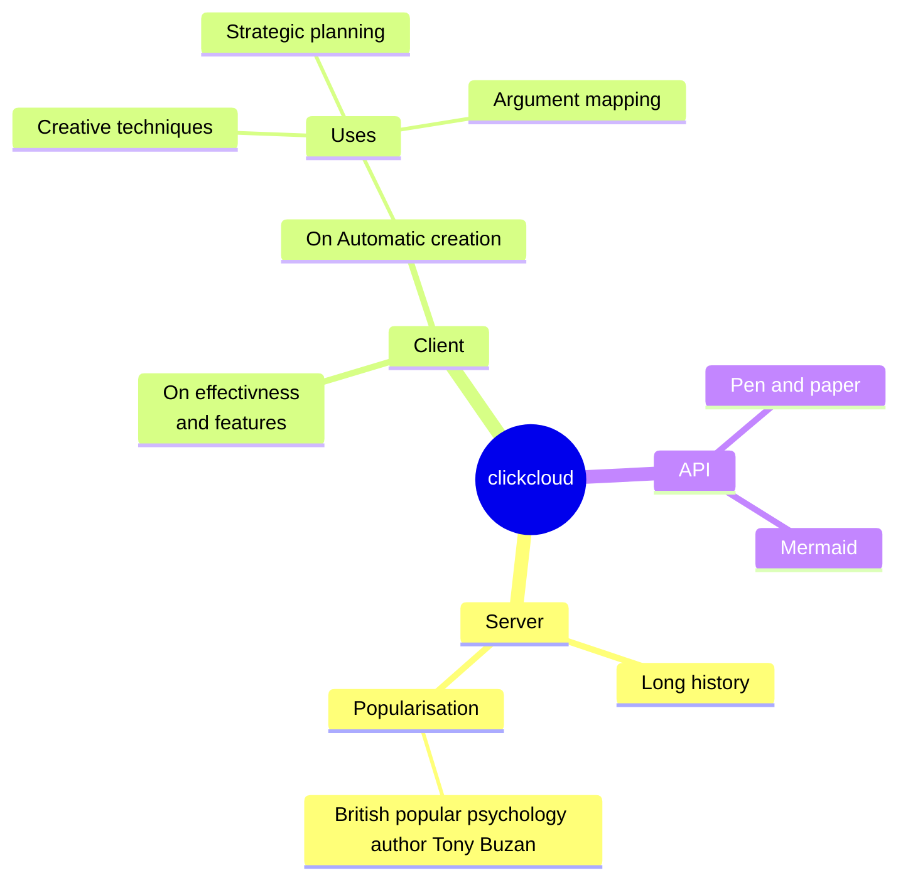

# ☁️ ClickCloud ☁️
## 01 개요
1. 서비스 소개
    * Google Maps를 표시하고 현재 보고 있는 지역의 날씨 실황을 확인할 수 있습니다.
    * 매 시 30분에 국내 날씨 데이터를 동기화합니다.
3. 작업 기간
    * 시작: 2024-01-04
    * 종료: 2024-01-24
4. 참여 인원

    | 이름 | 프로필 | 역할 |
    | :-: | :-: | --- |
    | <b>김수영</b> | [@suyons](https://github.com/suyons) | (1) 동해물과 백두산이 (2) 마르고 닳도록 |
    | 박지은 | [@parkje72](https://github.com/parkje72) | (1) 동해물과 백두산이 (2) 마르고 닳도록 |
    | 이동준 | [@null](https://github.com/) | (1) 동해물과 백두산이 (2) 마르고 닳도록 |

5. 개발 목적
    * 수업에서 학습한 내용 적용 연습 및 추가 학습을 통한 기술 확보
    * 수업에서 학습한 내용
        - (Back) Java, Oracle DB, JSP, SpringBoot
        - (Front) HTML, CSS, JavaScript: jQuery
    * 추가로 학습한 내용
        - (Git) Commit 작성 규칙 체화
        - (OpenAPI) Google Maps, 기상청 날씨데이터 서비스

## 02 사용 기술

| 구분 | 항목 | 목적 |
| :-: | :-: | --- |
| 서버 | SpringBoot | MVC 컨트롤러 구현 |
|  | MySQL | 날씨 데이터 수신 및 저장 |
|  | MyBatis | 데이터베이스 매핑 |
| 클라이언트 | jQuery | (1) 지도 이동 시 서버에 AJAX POST 요청 (2) 반응형 웹 |
|  | Bootstrap | CSS 라이브러리를 이용하여 간편한 요소 추가 |
| 공공 데이터 | OpenAPI | 공공 지도 및 날씨 데이터 수신 |
| 협업 | GitHub | (1) 개인별 Branch 작업 내역 관리 (2) 이슈 추적 관리 |
| 클라우드 | AWS Elastic Beanstalk | 서버 앱 배포 |
| CI/CD | GitHub Action | 코드 수정 시 AWS 자동 배포 |

## 03 구성도
**Mindmap**

## 04 구현 기능

## 05 돌아보며

## 06 참고 문서
