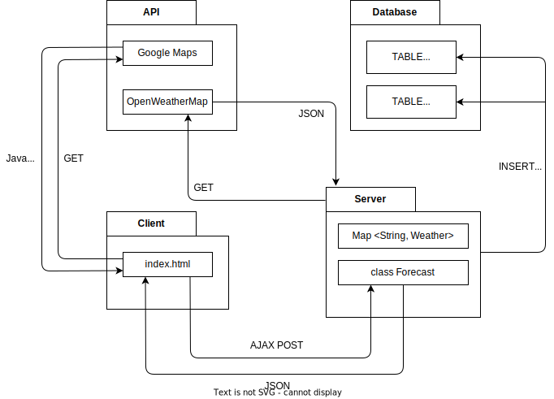

# ☁️ ClickCloud ☁️
## 01 개요
1. 서비스 소개
    * Google Maps에서 주요 도시의 날씨 실황을 아이콘으로 표시합니다.
    * 매 시간마다 주요 도시의 날씨 데이터를 업데이트합니다.
3. 작업 기간
    * 시작: 2024-01-17
    * 종료: 2024-01-23
4. 참여 인원 및 역할

    | 이름 | 프로필 | 역할 |
    | :-: | :-: | --- |
    | 김수영 | [@suyons](https://github.com/suyons) | (1) 아이디어 기획, 개발 환경 준비 (2) DB 설계 및 서버 연동 (3) 클라우드 배포 설정 |
    | 박지은 | [@parkje72](https://github.com/parkje72) | (1) 서버 REST API 구현 (2) 클라이언트 데이터 처리 |
    | 이동준 | [@mogri89](https://github.com/mogri89) | (1) 프론트엔드 페이지 작성 (2) 클라이언트 데이터 처리 (3) OpenAPI 도입 및 자원 관리 |

5. 개발 목적
    * 수업에서 학습한 내용 적용 연습 및 추가 학습을 통한 기술 확보
    * 수업에서 학습한 내용
        - (Back) Java, Oracle DB, JSP, Spring
        - (Front) HTML, CSS, JavaScript (jQuery)
    * 추가로 학습한 내용
        - (Git) Commit 작성 규칙 체화
        - (OpenAPI) 공공 데이터 API 서버에 비동기 요청 및 파싱

## 02 사용 기술

**기본 기능**

| 구분 | 항목 | 목적 |
| :-: | :-: | --- |
| 서버 | SpringBoot | REST API 및 서비스 |
|  | MySQL | 지역, 날씨 데이터 저장 |
|  | MyBatis | Java - MySQL 데이터베이스 매핑 |
| 클라이언트 | jQuery | AJAX 요청 및 결과 표시 |
|  | Bootstrap | CSS 라이브러리를 이용한 간편한 레이아웃 디자인 |
| OpenAPI | Google Maps | 클라이언트 웹에 지도 표시 |
|  | OpenWeatherMap | 지역별 날씨 데이터 제공 |
| 협업 | GitHub | (1) 개인별 Branch 작업 내역 관리 (2) 이슈 추적 관리 |

**클라우드 배포**

| 구분 | 항목 | 목적 |
| :-: | :-: | --- |
| 클라우드 | AWS Elastic Beanstalk | 서버 앱(JAR 패키지) 배포 |
|  | AWS RDS | MySQL 데이터베이스 구동 |
| CI/CD | GitHub Action | AWS 재배포 자동화 |

## 03 구성도
**Package Diagram**

**ER Diagram**

## 04 구현 기능

## 05 돌아보며

## 06 참고 문서
### server
* [[Spring] AJAX 예제: RSS 피드 XML 파싱 (Feat. jQuery)](https://velog.io/@syoungs/spring-3)
* [[Spring boot] 스프링부트, Mybatis 세팅 및 샘플 예시](https://needjarvis.tistory.com/771)

### client
* [Air Overflow: 지도 기반 미세먼지 확인 앱](https://adam-37.gitbook.io/joomadeung/projects/projects/undefined)
* [v0.dev: a weather app looks like the iOS weather app](https://v0.dev/t/bo2N7pU)
* [SunnyMap](https://sunnymap.net/)
* [Code Samples | Google for Developers](https://developers.google.com/maps/documentation/javascript/examples)
* [GitHub - mogri89/weatherapp](https://github.com/mogri89/weatherapp/)
* [Bootstrap 5 Tutorial - W3Schools](https://www.w3schools.com/bootstrap5/)

### database
* [SQL style guide by Simon Holywell](https://www.sqlstyle.guide/)
* [SQL Style Guide | The GitLab Handbook](https://handbook.gitlab.com/handbook/business-technology/data-team/platform/sql-style-guide/)
* [ERDCloud Library](https://www.erdcloud.com/library)
* [MySQL Connector/J Developer Guide](https://dev.mysql.com/doc/connector-j/en/connector-j-reference-type-conversions.html)
* [ISO 3166 Country List](https://www.localeplanet.com/icu/iso3166.html)

### OpenAPI
* [Current weather data - OpenWeatherMap](https://openweathermap.org/current)
* [Geocoding API - OpenWeatherMap](https://openweathermap.org/api/geocoding-api)
* [Weather Conditions - OpenWeatherMap](https://openweathermap.org/weather-conditions)

### other
* [[ClickCloud] 개발 환경 준비 안내](https://velog.io/@syoungs/project-2)
* [PPT 템플릿, 새별스러운 새별 블로그](https://blog.naver.com/PostList.naver?blogId=seiru523&categoryNo=169)